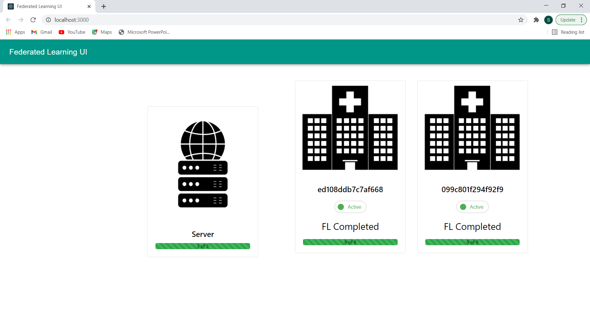

# Federated Learning Framework
This is an easy to use framework for federated learning along with a react ui for the same.

## To get started follow the steps below:

1. Install pytorch, torchvision for cpu or gpu as required
2. Run `pip install -r requirements.txt` to install the common requirements

3. To install necessary files for react UI:
   - Install [NodeJs](https://nodejs.org/en/).
   -  `cd react-app`
   -  `npm install`

4.  Use command `npm start` to start the UI. Head to localhost:3000 to view the UI
5.  Change server_config.yaml to suit your needs
6.  Have a copy of the client folder at each client and change client_config.yaml for each separate client, 
7.  Make sure to mention the dataset paths,labels, etc
8.  Start the server by running `python run_new_server.py`
9.  To start a client, cd to the client directory and run `python run_new_client.py` to start a new client
    
<!-- #### If a client crashes, do not panic. Instead take a chill pill and run 'python main_client.py' to resume the client and continue from the most recent fl round. -->
#### If a client crashes, run 'python main_client.py' to resume the client and continue from the most recent fl round.

<!-- 

  

 -->

